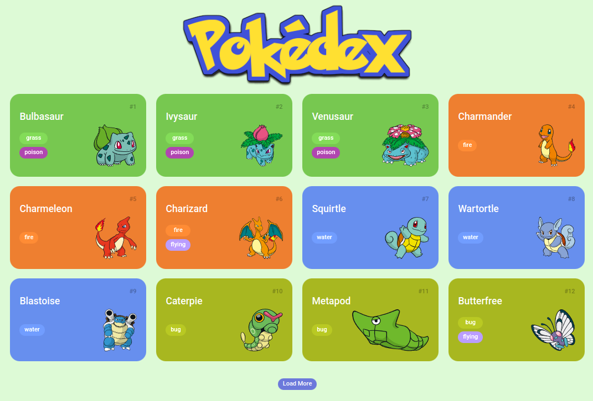

## Treinamento JS + Front

O projeto consiste em simular uma pokedex de Pokemon. Todos os dados são chamados através da Pokeapi.

## Tecnologias Usadas

- HTML
- CSS
- JavaScript Vanilla
- [PokéAPI](https://pokeapi.co/)
